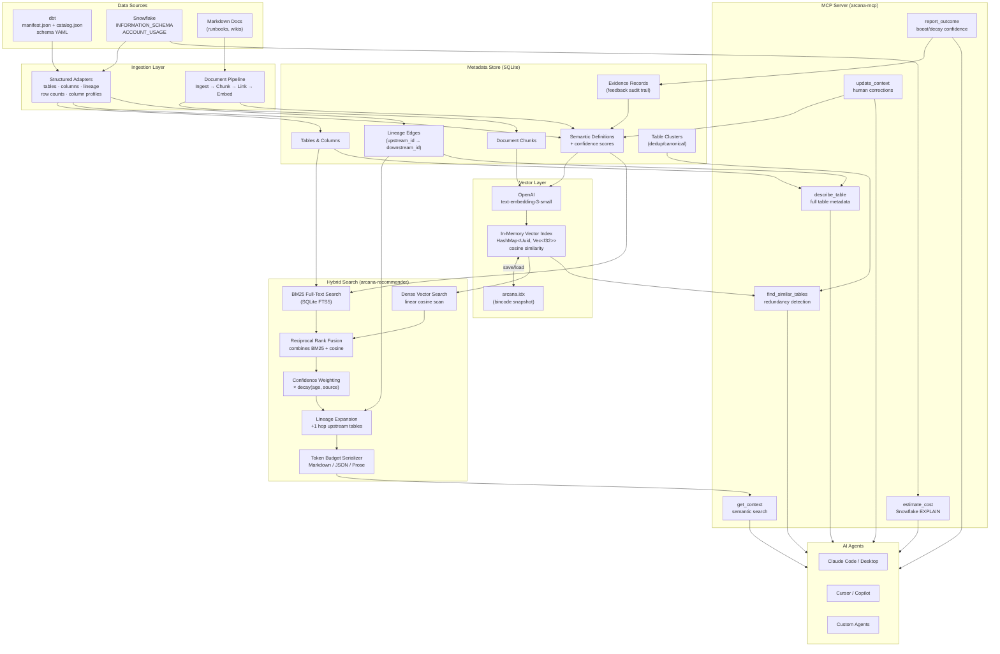
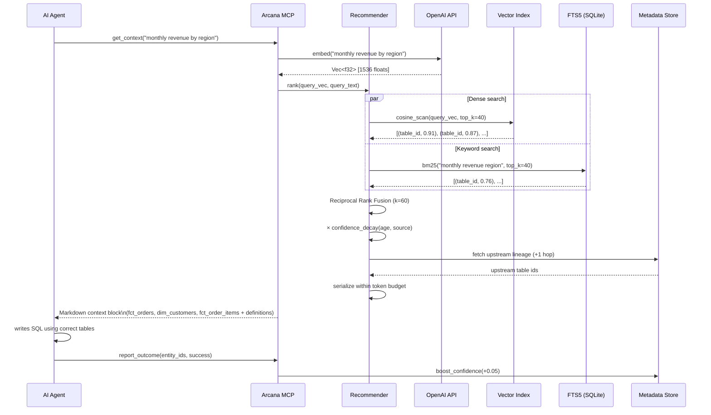
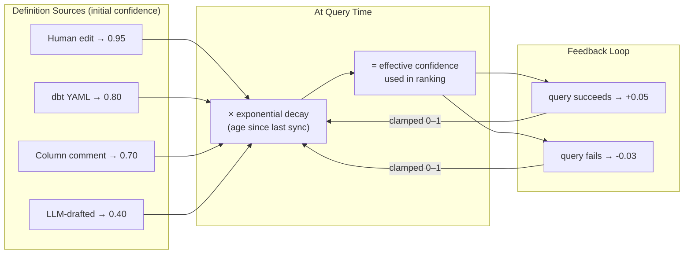

# Arcana — How It Works

## Full System Diagram

```mermaid
flowchart TD
    subgraph Sources["Data Sources"]
        DBT["dbt\nmanifest.json + catalog.json\nschema YAML"]
        SF["Snowflake\nINFORMATION_SCHEMA\nACCOUNT_USAGE"]
        MD["Markdown Docs\n(runbooks, wikis)"]
    end

    subgraph Ingest["Ingestion Layer"]
        ADAPTER["Structured Adapters\ntables · columns · lineage\nrow counts · column profiles"]
        PIPELINE["Document Pipeline\nIngest → Chunk → Link → Embed"]
    end

    subgraph Store["Metadata Store (SQLite)"]
        TABLES["Tables & Columns"]
        DEFS["Semantic Definitions\n+ confidence scores"]
        EDGES["Lineage Edges\n(upstream_id → downstream_id)"]
        DOCS["Document Chunks"]
        EVIDENCE["Evidence Records\n(feedback audit trail)"]
        CLUSTERS["Table Clusters\n(dedup/canonical)"]
    end

    subgraph Embeddings["Vector Layer"]
        OPENAI["OpenAI\ntext-embedding-3-small"]
        IDX["In-Memory Vector Index\nHashMap&lt;Uuid, Vec&lt;f32&gt;&gt;\ncosine similarity"]
        DISK["arcana.idx\n(bincode snapshot)"]
    end

    subgraph Search["Hybrid Search (arcana-recommender)"]
        FTS["BM25 Full-Text Search\n(SQLite FTS5)"]
        DENSE["Dense Vector Search\nlinear cosine scan"]
        RRF["Reciprocal Rank Fusion\ncombines BM25 + cosine"]
        CONF["Confidence Weighting\n× decay(age, source)"]
        LINEAGE["Lineage Expansion\n+1 hop upstream tables"]
        BUDGET["Token Budget Serializer\nMarkdown / JSON / Prose"]
    end

    subgraph MCP["MCP Server (arcana-mcp)"]
        GC["get_context\nsemantic search"]
        DT["describe_table\nfull table metadata"]
        EC["estimate_cost\nSnowflake EXPLAIN"]
        UC["update_context\nhuman corrections"]
        FST["find_similar_tables\nredundancy detection"]
        RO["report_outcome\nboost/decay confidence"]
    end

    subgraph Agents["AI Agents"]
        CLAUDE["Claude Code / Desktop"]
        CURSOR["Cursor / Copilot"]
        CUSTOM["Custom Agents"]
    end

    %% Ingestion flow
    DBT --> ADAPTER
    SF --> ADAPTER
    MD --> PIPELINE
    ADAPTER --> TABLES
    ADAPTER --> DEFS
    ADAPTER --> EDGES
    PIPELINE --> DOCS
    PIPELINE --> DEFS

    %% Embedding flow
    DEFS --> OPENAI
    DOCS --> OPENAI
    OPENAI --> IDX
    IDX <-->|save/load| DISK

    %% Search flow
    TABLES --> FTS
    DEFS --> FTS
    IDX --> DENSE
    FTS --> RRF
    DENSE --> RRF
    RRF --> CONF
    EDGES --> LINEAGE
    CONF --> LINEAGE
    LINEAGE --> BUDGET

    %% MCP tools
    BUDGET --> GC
    TABLES --> DT
    EDGES --> DT
    SF --> EC
    UC --> DEFS
    IDX --> FST
    CLUSTERS --> FST
    RO --> EVIDENCE
    EVIDENCE --> DEFS

    %% Agent interface
    GC --> Agents
    DT --> Agents
    EC --> Agents
    UC --> Agents
    FST --> Agents
    RO --> Agents
```

---

## Query Path: "monthly revenue by region"

```mermaid
sequenceDiagram
    participant Agent as AI Agent
    participant MCP as Arcana MCP
    participant Search as Recommender
    participant OAI as OpenAI API
    participant Idx as Vector Index
    participant FTS as FTS5 (SQLite)
    participant Store as Metadata Store

    Agent->>MCP: get_context("monthly revenue by region")
    MCP->>OAI: embed("monthly revenue by region")
    OAI-->>MCP: Vec<f32> [1536 floats]
    MCP->>Search: rank(query_vec, query_text)

    par Dense search
        Search->>Idx: cosine_scan(query_vec, top_k=40)
        Idx-->>Search: [(table_id, 0.91), (table_id, 0.87), ...]
    and Keyword search
        Search->>FTS: bm25("monthly revenue region", top_k=40)
        FTS-->>Search: [(table_id, 0.76), ...]
    end

    Search->>Search: Reciprocal Rank Fusion (k=60)
    Search->>Search: × confidence_decay(age, source)
    Search->>Store: fetch upstream lineage (+1 hop)
    Store-->>Search: upstream table ids
    Search->>Search: serialize within token budget

    MCP-->>Agent: Markdown context block\n(fct_orders, dim_customers, fct_order_items + definitions)
    Agent->>Agent: writes SQL using correct tables
    Agent->>MCP: report_outcome(entity_ids, success)
    MCP->>Store: boost_confidence(+0.05)
```

---

## Confidence Score Lifecycle

```mermaid
flowchart LR
    subgraph Sources["Definition Sources (initial confidence)"]
        H["Human edit → 0.95"]
        Y["dbt YAML → 0.80"]
        C["Column comment → 0.70"]
        L["LLM-drafted → 0.40"]
    end

    subgraph Live["At Query Time"]
        D["× exponential decay\n(age since last sync)"]
        R["= effective confidence\nused in ranking"]
    end

    subgraph Feedback["Feedback Loop"]
        S["query succeeds → +0.05"]
        F["query fails → -0.03"]
    end

    H --> D
    Y --> D
    C --> D
    L --> D
    D --> R
    R --> S
    R --> F
    S -->|clamped 0–1| D
    F -->|clamped 0–1| D
```
